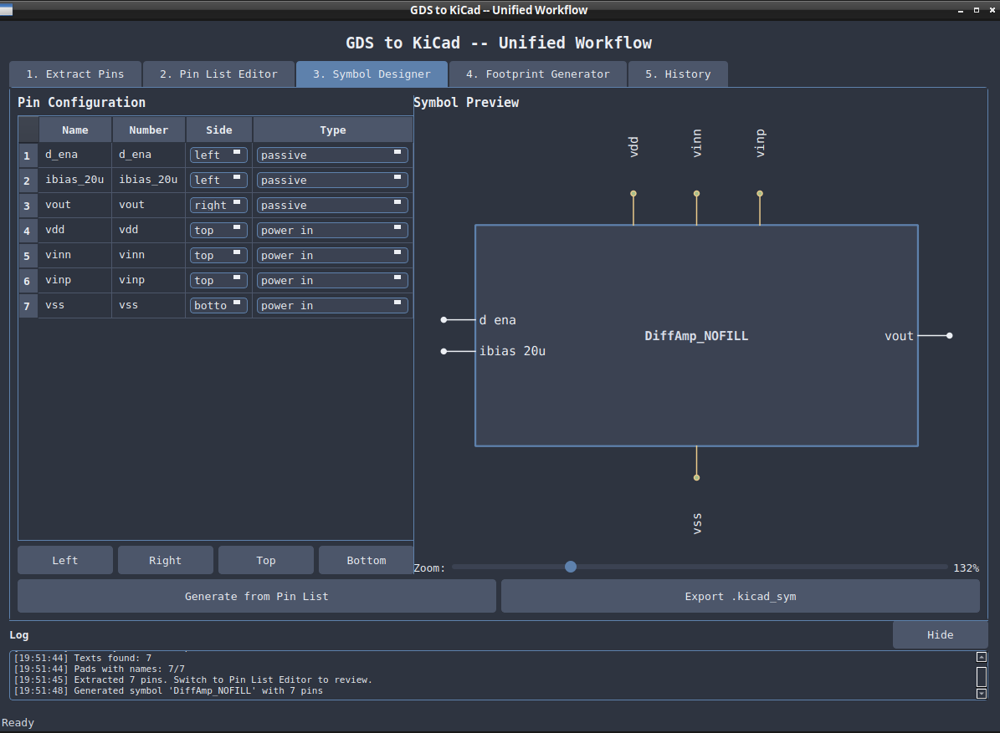

# gds2kicad

You designed a die or a chiplet in your silicon flow, the layout lives in a GDSII file, and now you need it on a board or an interposer in KiCad. KiCad does not read GDS, so the usual fallback is redrawing the bond pads by hand from a datasheet and copying pin names into a symbol cell by cell. For a hundred-pad die that is a day of error-prone busywork, and you do it again every time the layout changes.

gds2kicad does that translation for you. Point it at a GDS, tell it which layer the pads live on, and it writes a KiCad footprint or symbol with the pads placed at their real coordinates and named from the GDS text labels. It also handles the cases the simple story leaves out: closed chiplets that ship no layer file, dies that mount face-down on an interposer, non-rectangular pads, and feeding a routed board back into a chiplet netlist.

## PDK-agnostic by design

There is no PDK baked in and nothing to configure. The converter learns your layer numbers from a standard KLayout `.lyp` layer-properties file that you pass with `--lyp-file`. Any process works as long as you supply that file, or you can skip layer names entirely and hand it the raw `layer/datatype` number directly. There is no `--pdk` flag and no PDK discovery: you choose the layer file explicitly, always.

The `pdks/` directory ships four ready examples:

- `generic.lyp`, a minimal pads-only vocabulary (pad metal `205/0`, pad text `205/25`, outline `206/0`) for black-box chiplets that carry no layer file. This is the default when you omit `--lyp-file`.
- `interposer.lyp`, the IHP SG13G2 upper-metal stack (Metal4 up through Bump), handy for interposer work.
- `sg13g2.lyp`, the full IHP SG13G2 layer set.
- `sky130.lyp`, the full SkyWater sky130 layer set.

IHP SG13G2 is the example we test against most heavily, not a requirement. For any other technology, drop its KLayout `.lyp` into `pdks/` (or pass any path with `--lyp-file`) and reference layers by name.

## Install

You need Python 3, the KLayout Python module (for reading GDS), and PyQt6 (for the GUIs).

```sh
python3 -m venv venv && source venv/bin/activate
pip install -r requirements.txt
pip install klayout          # or use a system KLayout install
```

KLayout does the GDS reading. If `import klayout.db` fails, the converters exit with an error telling you so.

## The GUI: the easy way in

If you would rather click than memorize flags, `unified_gui.py` is the front end, and the simplest way to use any of this. One window walks the whole job across five tabs: pull the pins out of a GDS, fix up the pin list, design the symbol against a live preview, generate the footprint, and look back over past runs. It drives the same engine as the command line.

```sh
python3 unified_gui.py
```



Above is the Symbol Designer: set each pin's side and type on the left, watch the symbol redraw on the right, then export the `.kicad_sym`. If you only want one job, `gds_to_kicad_gui.py` (footprints) and `gds_to_kicad_symbol_gui.py` (symbols) are the focused versions. On a headless box, set `QT_QPA_PLATFORM=offscreen`.

The GUIs handle name-based layer selection and the common path. The command line below covers the same ground and adds the power-user knobs, raw layer numbers, pad review, flip-chip, `--design-dir`.

## Quickstart: a die to a footprint

The fast path. Give it a GDS and the pad layer, get a `.kicad_mod` back:

```sh
python3 gds_to_kicad.py my_die.gds --lyp-file pdks/sg13g2.lyp \
    --layer TopMetal2.drawing --text-layer TopMetal2.text -o my_die.kicad_mod
```

That reads the top cell, flattens it, pulls box and polygon shapes off the pad layer, matches text labels to pads as names, and writes pads (rectangular as `smd rect`, non-rectangular as `smd custom` with a `gr_poly` primitive), a courtyard, and traceability properties recording the source GDS, the `.lyp`, the layer, and the orientation (`GDS_FILE`, `LYP_FILE`, `GDS_LAYER`, `ORIENTATION`).

Not sure which layer holds the pads? Inspect first:

```sh
python3 gds_to_kicad.py my_die.gds --scan-layers                    # suggests pad/text candidates
python3 gds_to_kicad.py my_die.gds --list-layers --lyp-file pdks/sky130.lyp
```

If you have no usable `.lyp`, e.g. a closed-PDK GDS, name the layer by its raw `N/D` number, or let the densest-pad-layer auto-detector pick:

```sh
python3 gds_to_kicad.py chiplet.gds --pad-layer-number 134/0 --text-layer-number 134/25 -o chiplet.kicad_mod
python3 gds_to_kicad.py chiplet.gds -o chiplet.kicad_mod            # no layer flags: auto-detect
```

For a die that mounts face-down on an interposer, add `--flip-chip` to mirror X so the footprint reads as seen from the interposer side.

### When auto-detect isn't enough: pad review

Real die GDS files are full of routing, fills, and guard rings that are not bond pads. For those there is a human-in-the-loop step. First strip the GDS down to just the pad layer and labels:

```sh
python3 gds_to_kicad.py my_die.gds --generate-pad-review review.gds
```

Open `review.gds` in KLayout, delete everything that is not a real pad, save. Then build the footprint from the cleaned-up GDS plus an authoritative pin list:

```sh
python3 gds_to_kicad.py --from-pad-review review.gds --pin-list pins.json -o my_die.kicad_mod
```

Pads are named by nearest-neighbor matching against the pin list, with warnings for anything unmatched.

## The rest of the suite

**GDS to symbol.** `gds_to_kicad_symbol.py` runs the same pad-and-text extraction and emits a KiCad 6+ `.kicad_sym` library. It auto-arranges pins, power top and bottom, signals left and right, and writes the schematic body for you.

```sh
python3 gds_to_kicad_symbol.py my_die.gds --lyp-file pdks/sg13g2.lyp --pad-layer TopMetal2.drawing -o my_die.kicad_sym
```

It has the same name / raw-number / auto-detect layer selection, plus a two-step human-in-the-loop path: `--extract-pins pins.json` dumps an editable pin list, you fix names, sides, and types, then `--from-pin-list pins.json` regenerates the symbol with no GDS needed.

**Black-box mode.** When you only know a chiplet's pad map, names, centers, sizes from a datasheet, and have no GDS and no layer file, `blackbox_chiplet.py` synthesizes a minimal stand-in GDS. It stamps pad metal, pad-name labels, and a die outline onto the generic canonical layers (`205/0`, `205/25`, `206/0`), so the result drops straight into the converters above with no flags.

```sh
python3 blackbox_chiplet.py chiplet_pads.json -o chiplet.gds      # JSON or CSV pad spec
python3 blackbox_chiplet.py pads.csv -o chiplet.gds --no-manifest
```

The spec is JSON or CSV, chosen by extension. CSV is a `name,x_um,y_um,w_um,h_um` header with one pad per row; the JSON form adds an optional explicit `die` size and a `chiplet_name`. Pad `x`/`y` are **center** coordinates. Without an explicit die, the outline is derived from pad extents plus a margin. Alongside the GDS it writes a `<stem>.boundaries.json` manifest carrying the die outline as the chiplet boundary for assembly DRC (suppress with `--no-manifest`).

**Netlist to chiplet.** `kicad_netlist_to_chiplet.py` turns a KiCad S-expression netlist (`.net`) into chiplet-flow YAML and/or CSV, or injects a `netlist:` section straight into a `.chiplet` file:

```sh
python3 kicad_netlist_to_chiplet.py design.net --yaml nets.yaml --csv nets.csv
python3 kicad_netlist_to_chiplet.py design.net --inject board.chiplet --summary
```

Nets are classified power/ground/signal by name. Footprints from the `io_pads` library (or any ref prefix you pass with `--external-ref-prefix J`) are flagged `external: true`. `footprint_to_pinlist.py` goes the other way, pulling pad geometry out of one or more `.kicad_mod` files into a PinList JSON.

**I/O pad helpers.** `io_pads/generate_io_pad.py` emits a parametric KiCad symbol and footprint for an external interposer I/O pad, tagged with `IO_CLASS` and `IO_PAD_SIZE_UM` properties. Only `wire_bond` is implemented today; `flipped_bump` and `tsv_bump` are reserved and rejected. After routing, `io_pads/kicad_pcb_to_iopads.py` walks a `.kicad_pcb`, keeps the footprints carrying an `IO_CLASS`, and writes an `io_pads.json` of locations, sizes, and nets (mm to um, Y negated for the GDS Y-up convention).

```sh
python3 io_pads/generate_io_pad.py --io-class wire_bond --size 100x100
python3 io_pads/kicad_pcb_to_iopads.py design.kicad_pcb -o io_pads.json
```

## Where things go

By default, generated files land in the current directory (footprints under `generated_kicad_footprint_files/`, symbols under `generated_kicad_symbol_files/`). Set `GDS_TO_KICAD_DATA_DIR` to pin that base elsewhere, use `-o` for an exact path, or `--design-dir DIR` to follow the `<DIR>/<design>.pretty/` per-design convention.

## License

GPL-3.0-or-later. See [LICENSE](LICENSE). Internals, conventions, and how to run the test suite are in [docs/DEVELOPER_GUIDE.md](docs/DEVELOPER_GUIDE.md).
